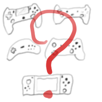
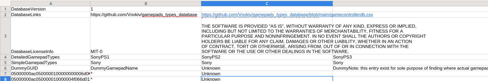
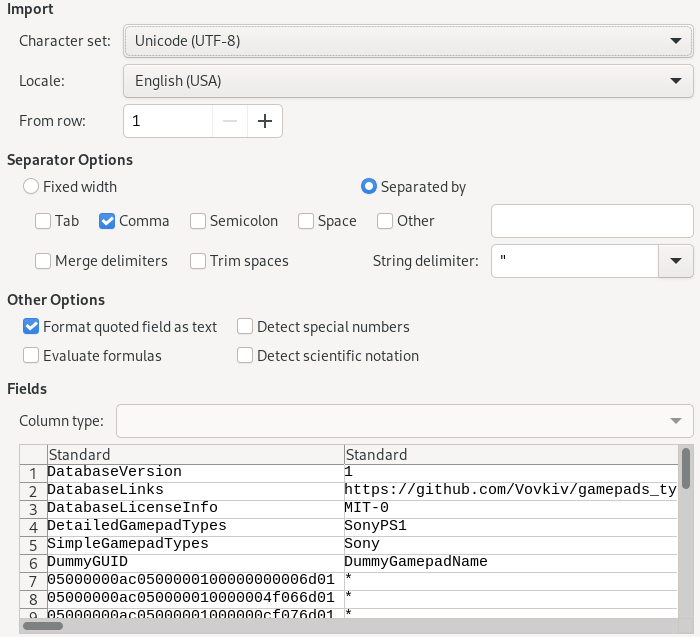
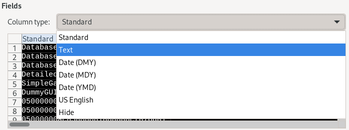

# About

[https://github.com/grif-on/generic_gamepads_types_database](https://github.com/grif-on/generic_gamepads_types_database)

---



This project provides csv file which map gamepad types based on their GUID and names for showing correct gamepad icons in games.
https://github.com/grif-on/generic_gamepads_types_database
This project tries to support as much as possible of gamepads, official or 3rd party. In fact, this was initial goal to make guessing easir not only for official/"big" manufactures, like Sony or Microsoft

If you need to show correct gamepad prompts for XBOX, PlayStation or Nintendo (or replicas of said consoles/gamepads) and some other popular consoles/gamepads with easy, then you come to right repository!

# Credits
[SDL_GameControllerDB](https://github.com/mdqinc/SDL_GameControllerDB), by mdqinc and SDL community.
Originally, this database started as copy of their database with removed unneeded data, such as mappings for gamepads, but later evolved in what it currently is.
```license
Copyright (C) 1997-2022 Sam Lantinga <slouken@libsdl.org>
  
This software is provided 'as-is', without any express or implied
warranty.  In no event will the authors be held liable for any damages
arising from the use of this software.

Permission is granted to anyone to use this software for any purpose,
including commercial applications, and to alter it and redistribute it
freely, subject to the following restrictions:
  
1. The origin of this software must not be misrepresented; you must not
   claim that you wrote the original software. If you use this software
   in a product, an acknowledgment in the product documentation would be
   appreciated but is not required. 
2. Altered source versions must be plainly marked as such, and must not be
   misrepresented as being the original software.
3. This notice may not be removed or altered from any source distribution.
```
---

Some consoles short descriptions were taken from Wikipedia.

---
License of this database is `MIT-0` and full text can be read here: [LICENSE](LICENSE) or just here:
```license
MIT No Attribution

Copyright 2024 volkov

Permission is hereby granted, free of charge, to any person obtaining a copy of this
software and associated documentation files (the "Software"), to deal in the Software
without restriction, including without limitation the rights to use, copy, modify,
merge, publish, distribute, sublicense, and/or sell copies of the Software, and to
permit persons to whom the Software is furnished to do so.

THE SOFTWARE IS PROVIDED "AS IS", WITHOUT WARRANTY OF ANY KIND, EXPRESS OR IMPLIED,
INCLUDING BUT NOT LIMITED TO THE WARRANTIES OF MERCHANTABILITY, FITNESS FOR A
PARTICULAR PURPOSE AND NONINFRINGEMENT. IN NO EVENT SHALL THE AUTHORS OR COPYRIGHT
HOLDERS BE LIABLE FOR ANY CLAIM, DAMAGES OR OTHER LIABILITY, WHETHER IN AN ACTION
OF CONTRACT, TORT OR OTHERWISE, ARISING FROM, OUT OF OR IN CONNECTION WITH THE
SOFTWARE OR THE USE OR OTHER DEALINGS IN THE SOFTWARE.
```

# Syntax of database


or in raw view:

```csv
"DatabaseVersion","1"
-- 2nd column is version of database syntax. If it somehow will change significantly, this number will be changed.
"DatabaseLinks","https://github.com/grif-on/generic_gamepads_types_database","https://github.com/grif-on/generic_gamepads_types_database/blob/main/gamecontrollerdb.csv"
-- 2nd column is link to database repo, 3rd column is direct link to database file, which can be used to implement auto updating for database.
"DatabaseLicenseInfo","MIT-0","MIT No Attribution TEXT"
-- 2nd column is for license type, 3rd for license full text that you can show in your game, if you want to.
"DetailedGamepadTypes","SonyPS1","SonyPS2","SonyPS3"
-- Detailed gamepad types that this database has.
"SimpleGamepadTypes","Sony","Sony","Sony"
-- Simplified gamepad types. Note, that amount if simple types will always be same as detailed. 
"DummyGUID","DummyGamepadName","Unknown","DummyNote: Some note."
-- The database of gamepads.
-- 1st column is GUID of gamepad. Usually, SDL-based game engines (or engines that don't use SDL, but still relies on SDL database, like Godot) or frameworks or libraries expose function which will to get GUID of connected gamepad.
-- Compare this variable via for loop with every GUID that this library has and if you found one, then retrive from 3rd column gamepad type on that line.
-- 2nd column is name that gamepad with said GUID might report. Compare name of gamepad with this value and retrive type on that line.
-- Note: this database doesn't contain all possible GUID variables, so they might be missing, BUT
-- some gamepads still might report correct name that this database has, thus correctly detecting type.
-- (If GUID of your gamepad missing, please, refer to Contacts at bottom of this README and report this GUID to me).
-- 3rd column is actually detailed type that gamepad will report.
-- 4rd column reserved for notes that I might leave about some gamepads. They don't serve any other functional purpose, so I advise you to remove 4rd columns in gamepads database to save some memory.
```

In [Implementations](#implementations) section you can found some already existing implementation to get better idea how to implement your own or just use them.

# Editing database
Realistically, you might want to open this database by hand only in 2 cases:

1. You want to add missing gamepad to database for opening PR or just for testing purposes.
2. You might want to change something else for testing or other purposes.

If this are case for you, I recommend opening database file via [LibreOffice Calc](https://www.libreoffice.org/).

But before opening file:


Make sure that "Character set:" is "Unicode (UTF-8)"

And:



Click on CSV file preview window and press `Ctrl+A` to select everything inside there, and in "Column type" select "Text".
If you won't do so, GUIDs of gamepads might become broken, because LibreOffice will try to interpret them as numbers, which might produce unexpected results.

# Types

#### General rule how gamepad type is chosen
(for more detailed reasoning check next sub-section)

Gamepad type is chosen (usually, I still can make mistakes) based on what labels it uses for buttons:

* If it uses numbers as labels then device most likely become `Generic1234`.
* If device uses ABC or other letters combinations that is not used in/copied from other popular gamepads, then it most likely become `GenericABC`.
  
> [!NOTE]
> Old Sega and Nintendo gamepads, in fact, used various ABC buttons, but because they have their own respective types for cultural meaning and built quality. If some 3rd party will produce gamepads/devices that SPECIFICALLY built as replica of such gamepads (Such 3rd party as 8BitDo company), they will be included in Sega/Nintendo types. Other 3rd party gamepads that happens to use ABC buttons and not indented to be replica of Sega/Nintendo become `GenericABC`.

* If device uses triangle, circle, cross and square - most likely it will be something from Sony, like `SonyPS5`.
* If device uses YBAX buttons, where Y is on top and A on bottom, then most likely it become something from XBOX, like `MicrosoftXBOX360`.
* Some devices from Sega/clones of Sega will have special types assigned for them, like `SegaDreamCast`, because SDL database.
* Some devices will be laveled as `Atari` because SDL database labeled them as such or because gamepad developers tries to emulate Atari gamepad.
* Some devices will be labeled like `Commodore64` because SDL database said so or developers of device.
* SDL can detect some virtual gamepads, and as such, they will be typed as `VirtualGamepad`
* Devices from Valve have special types, such as `ValveSteamDeck`
* If device uses YABX buttons, where X is on top and B on bottom then most likely it will become Nintendo, specifically, `NintendoSwitch`.
* If device doesn't even uses labels for buttons (yes, there exist such gamepads) then it most likely become `Unknown`.
* Devices from SNK company has special types, like `SNKNeoGeo`.

#### Detailed types

* `SonyPS1` - Gamepads for PlayStation 1 video game console, produced by Sony. Uses triangle (green label), circle (red label), cross (blue label) and square (pink label) for labels. Don't have sticks.
* `SonyPS2` - Gamepad for PlayStation 2. Most notable change compared to PS1 gamepad was addition of 2 sticks.
* `SonyPS3` - Gamepad for PlayStation 3. Gamepad visually didn't changed compared to PS2 gamepad, but now it has gyroscope.
* `SonyPS4` - Gamepad for PlayStation 4. Gamepad was redesigned, but labels didn't changed much, except "Select" and "Start" buttons changed shape and renamed to "Share" and "Options". Now gamepad has touch panel, microphone, audio input.
* `SonyPS5` - Gamepad for PlayStation 5. Gamepad again got redesign but much drastic this time. Most notable, buttons (and gamepad itself in general) now uses black-white coloring, rather then different colors. Previously changed buttons "Share" and "Options" instead of text use icons. Gamepad changed shape. Has adaptive triggers.
* `SonyPSP` - Portable game console made by Sony. Uses same labels as PS3, and have only 1 stick.
* `SonyPSVita` - apparently, some people figured out how to use PSVita as gamepad, or SDL detect PSVita's gamepad when it run on this console. Uses labels similar to PSP, and has 2 sticks.
* `MicrosoftXBOXOriginal` - First big game console made by Microsoft. Has quite weird shape and general doesn't look that appealing. Has 2 sticks, dpad, YBAX buttons are fully colored - Y label and button has yellow color, B label and button red colored, A label and button green colored, X label and button blue colored.
* `MicrosoftXBOX360` - most notable, shape was redesigned along side with sticks, but everything else like buttons or labels stayed the same.
* `MicrosoftXBOXOne` - Got big redesign to shape and colors, looks much modern. Notable, YBAX buttons now black, only buttons labels colored now. Like in PS4, buttons "start" and "select" changed labels. Now they uses icons instead of text.
* `MicrosoftXBOXSeries` - got redesign, but not as drastic. Most notable added "share" button.
* `NintendoNES` - Nintendo Entertainment System (NES) is an 8-bit video game console released by Nintendo in North America, South America, Europe, Asia, Oceania, and Africa and was Nintendo's first home video game console released outside Japan. Gamepad has dpad, select and start buttons, B and A buttons.
* `NintendoFamicom` - was first released in Japan on July 15, 1983, as the Family Computer (Famicom). Same as `NintendoNES`, but has different colors.
* `NintendoSNES` - 16-bit home video game console developed by Nintendo that was released in 1990 in Japan and South Korea. Compared to `NintendoNES`, gamepad has 2 more buttons: Y and X.
* `Nintendo64` - was released in Japan on June 23, 1996, in North America on September 29, 1996, and in Europe and Australia on March 1, 1997. Has dpad, B (blue colored) and A (green colored), 4 yellow buttons, stick in center.
* `NintendogameCube` - It was released in Japan on September 14, 2001, in North America on November 18, 2001, in Europe on May 3, 2002, and in Australia on May 17, 2002. It is the successor to the Nintendo 64. Has dpad, white stick, yellow stick, B (red colored), A (green colored), X and Y (both gray) buttons. 
* `NintendoWii` - released the Wii on November 19, 2006, as their seventh-generation home console. Nintendo designed the console to appeal towards a wider audience than those of its main competitors, the PlayStation 3 and Xbox 360, including "casual" players and audiences that were new to video games. Main selling point of gamepad is motion/gyroscope, has dpad, A button, +, home and - buttons, 1 and 2 buttons.
* `NintendoWiiU` - is a home video game console developed by Nintendo as the successor to the Wii. Released in late 2012, it is the first eighth-generation video game console and competed with Microsoft's Xbox One and Sony's PlayStation 4. WiiU has gamepad that looks similar to modern Nintendo Switch. Has dpad, touch screen, 2 sticks, XABY buttons, select and start.
* `Nintendo3DS` - is the successor to the DS and is a brand new console. The Nintendo 3DS was released on February 26, 2011. Has 2 screens, dpad, stick and XABY buttons.
* `NintendoSwitch` - was released on March 3, 2017, and is Nintendo's second entry in the eighth generation of home video game consoles. Has 2 sticks, dpad, XABY buttons.
* `SegaMegaDrive` - The Sega Genesis, known as the Mega Drive outside North America, is a 16-bit fourth generation home video game console developed and sold by Sega. Has dpad, ABC buttons, start button.
* `SegaSaturn` - is a home video game console developed by Sega and released on November 22, 1994, in Japan, May 11, 1995, in North America, and July 8, 1995, in Europe. Has dpad, XYZ buttons, ABC buttons.
* `SegaDreamCast` - is the final home video game console manufactured by Sega. It was released on November 27, 1998, in Japan; September 9, 1999, in North America; and October 14, 1999, in Europe. Has stick, dpad, start button, Y (green) B (blue) A (red) X (yellow) buttons.
* `SNKNeoGeo` - is a ROM cartridge-based video gaming system released on April 26, 1990, by Japanese game company SNK Corporation. Has stick, ABCD buttons, select and start buttons.
* `Atari` - The Atari 2600 is a home video game console developed and produced by Atari, Inc. Has stick and button.
* `Commodore64` - also known as the C64, is an 8-bit home computer introduced in January 1982 by Commodore International (first shown at the Consumer Electronics Show, January 7–10, 1982, in Las Vegas). Stick and button.
* `ValveSteamController` - is a discontinued game controller developed by Valve for use with personal computers, running Steam on Windows, macOS, Linux, smartphones or SteamOS. Has stick, dpad in form of touchpad, touchpad, YBAX buttons colored like on XBOX One.
* `ValveSteamDeck` - is a handheld gaming computer produced by Valve, designed to run the large library of games available on the Steam storefront client. Has 2 sticks, 2 touchpads, YBAX buttons, triggers.
* `VirtualGamepad` - SDL can detect some virtual gamepads, such as Steam Virtual Gamepad (usually can be found if someone play game on their smartphone/table via Steam Link) or some emulator's virtual gamepads. As far as I understand, such virtual gamepads can have any labels, but most likely it will be something XBOX-like, so keep it in mind.
* `Generic1234` - usually some cheap clones of popular gamepads. Often, clones of PS3 gamepad with 1234 buttons (painted in PlayStation colors) instead of triangle, circle, cross and square. Most notable example: Defender gamepad. Most likely you seen one.
* `GenericABC` - same deal as with `Generic1234` but for labels this gamepads might use letters (or combination of letters and numbers) that is not found in popular gamepads, like PlayStation, XBOX or Nintendo. Most of generic gamepads that uses letters as labels are fightpads - gamepads build specifically for 2d fighter games, such as Mortal Kombat. Usually they have 1 stick on left side and many buttons (that usually labeled with ABC, hence the title of type) on right one. Since this type of gamepads is even less popular then `Generic1234`, you most likely can treat `GenericABC` as `Generic1234` because most likely this gamepads won't have labels that you might expect anyway.
* `Unknown` - gamepad or device that is impossible to verify. Usually it is safe to ignore such devices (or threat them as `Generic1234`), since most likely they are niche cheap gamepads that most people, probably, wont use anyway. And since device is unknown, it is impossible to predict what labels for buttons it will use anyway.
* `UnknownAdapter` - there exist bunch of adapters - devices that allow you to connect gamepad to console/PC/smartphone/etc that it was not intended to. For example, adapter that allow you to connect Nintendo Game Cube gamepad to PlayStation 4. In such cases, adapter will be typed as `SonyPS3` or `NintendoNES`. But there exist adapters that can connect wide variety of devices, for example both PlayStation 2 gamepad and Nintendo Switch's Joy-Cons. Since we can't verify what exactly device will be connected via adapter, it will be marked as `UnknownAdapter`.

#### Simple types
Database provide simplified types, that can be useful if you want to support only limited set of gamepad types. For example, instead of drawing icons for PS1-5, PSP, PSVita, etc you want to icons draw only for PS5 gamepad, then you can use simple type which will output single type for all of this device. For example, all mentioned Sony devices/gamepads become simple `Sony`.

* `Microsoft` - they produce they own consoles and gamepads, which is widely used and known. If someone plays with gamepad in your game - most likely it will be XBOX gamepad (or at least 3rd party XBOX-like gamepad). Their gamepad famous for being standardized. Gamepad from XBOX Original and from latest XBOX Series is pretty much same in terms of functionality and labels used. All that is different is gamepad form factor and slightly redesigned buttons - Original's/360 entire YBAX buttons were painted in their respective colors, while in One/Series only labels themselves were painted, while buttons is black colored.
* `Sony` - to this day, they produce gamepads/consoles that uses almost same layout: dpad, triangle, circle, cross and square. The only difference is that older PlayStation gamepads (PS1, PS2) didn't had sticks, PSP had only 1 left stick, but other then that, they uses same labels, so if you want to cover most of Sony devices, you can draw icons for currently latest PlayStation 5 gamepad and show them to users with PS4 and PS3 gamepads. Sony gamepads quite popular around PC players, so you most likely want to support at least PS5 gamepad icons.
* `Nintendo` - Story is similar with Sega with exception that Nintendo still produces new consoles/gamepads to this days. And just like Sega, they produces many different consoles/gamepads with vastly different controls, but most likely, you want to support their latest console Nintendo Switch and detachable JoyCons gamepad. 
* `Sega` - Sega lost console wars and therefore doesn't produces new gamepads or consoles anymore, so you probably won't see much of this gamepads, and therefore you can treat device with such type as `Generic` or `Microsoft`. But there still some manufactures that produces replicas of Sega's gamepads for nostalgia purposes. Keep in mind that each generation of Sega's gamepads/consoles has very different buttons and have/don't have some. Sega Genesis (or Sega Mega Drive) doesn't have any sticks and uses XYZ and ABC buttons, while Sega DreamCast is much closer to XBOX-like: having left stick, familiar YBAX buttons.
* `SNK` consoles/gamepad/devices made by company SNK Corporation. They don't make consoles anymore, so most likely when you stumble upon this type, it means that it is most likely replica from 3rd party manufactures.
* `Atari` - is a brand name that has been owned by several entities since its inception in 1972. If you stumble upon this type, most likely this is 3rd party replica of gamepads.
* `Commodore` - devices made by Commodore International Corporation. If you stumble upon this type, then it's most likely 3rd party replica of their gamepads/devices.
* `Valve` - way back in days, Valve tried to create their own console - Steam Machines. And it used quite unique gamepad - Steam Controller -that had touchpad-like d-pad, touchpad instead of right stick, but aside from this, it used XBOX-like labels. Now they don't produce this gamepads anymore (and as far I can tell, they don't plan to in future), so most likely you wont see them much anymore.
As of now, they produce their own console named Steam Deck - it uses XBOX-like labels (same as Steam Controller) and has 2 additional touchpads that user can use to customize additional buttons.
Since their devices use XBOX-like labels, you could safely threat `Valve` as `Microsoft` if you can't/don't want to support additional icons.
* `VirtualGamepad` - same as in detailed types.
* `Unknown` - all unknown devices (or devices that don't have labels on buttons) will be included here.
* `Generic` - Look for `Generic1234` and `GenericABC` in detailed types, but in general, `Generic` gamepad is device that uses numbers for labels or letters that is not found in other popular gamepads, such as XBOX, PlayStation or Nintendo.

# Reporting missing data

If you believe that I labeled gamepad with incorrect type, your gamepad is missing or you have other proposals, please, check [Contacts](#contacts) section.

# Implementations
#### Official implementations:
* [love2d](https://love2d.org/) [implementation, by volkov](https://github.com/grif-on/love2d_gamepad_guesser_solution)
#### Community maintained implementations:
* None, currently.

# Implementation tips
* You should treat GUID as absolutely correct way to detect gamepad name, and if GUID is missing, use name guessing as fallback. You can see this in my love2d implementation.
    + This idea will looks something like this in practice (lua pseudo code):
    ```lua
	local type, success = guess_gamepad_by_guid(get_gamepad_guid())
	if not success
		-- Seems database lack GUID of this gamepad. Lets try to guess via name instead.
		type, success = guess_gamepad_by_name(get_gamepad_name())
		if not success then
			-- Seems this gamepad is missing in my database! Sorry!
			-- Report this to me, please!
			-- In meantime, we would use fallback type instead.
			type = "MicrosoftXBOX360"
		end
	end
	```

# Contacts
* Open [New Issue](https://github.com/grif-on/generic_gamepads_types_database/issues/new) on repo.